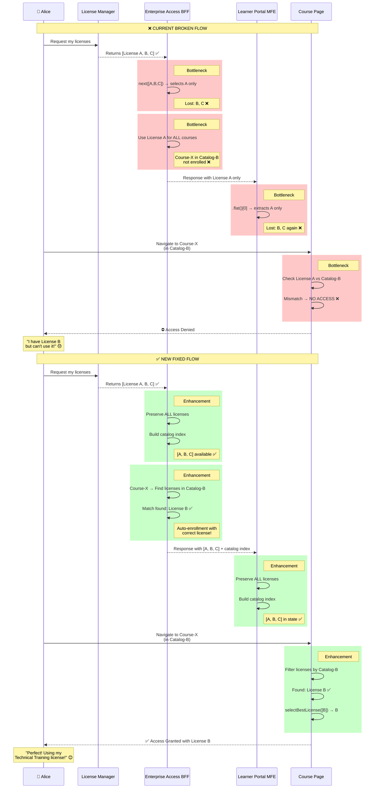
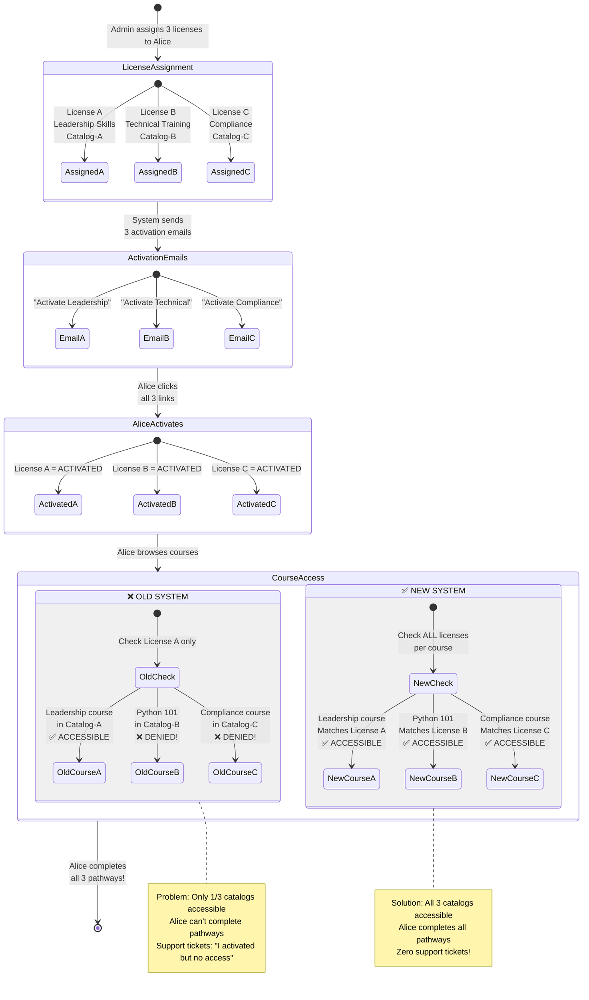
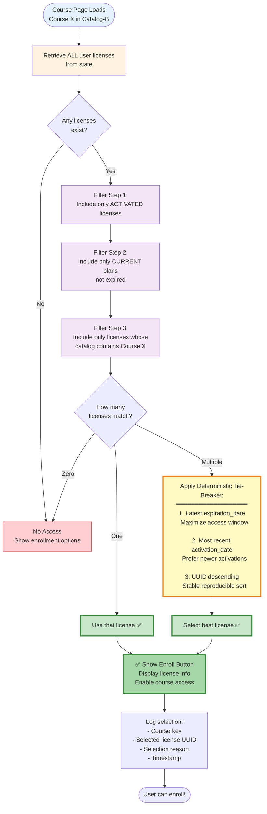
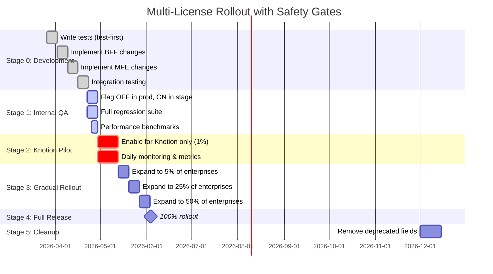

# Multiplex Subscription Licenses - Solution Architecture

**Date:** March 26, 2026  
**Version:** 1.0  
**Status:** Proposed Architecture  
**Architect:** Solution Design based on edX Enterprise Platform Analysis  

**Related Documents:**
- [Requirements (test.txt)](test.txt)
- [Current Process Analysis](current-license-selection-process-code-walkthrough.md)
- [Implementation RFC](multiplex-subscription-licenses-rfc.md)

---

## Executive Summary

### Problem Statement
The edX enterprise platform currently **collapses multiple active subscription licenses to a single license** at 4 critical bottlenecks, preventing learners from accessing courses they're entitled to through alternative licenses. This blocks Knotion's "Learning Pathways" feature and limits multi-catalog enterprise use cases.

### Architectural Root Cause
**Single Responsibility Violation:** The system conflates two distinct concerns:
1. **Data retrieval** (getting all licenses) 
2. **Selection logic** (choosing which license applies to a specific course)

Current architecture performs selection too early (at data layer), losing information needed for downstream course-level decisions.

### Proposed Solution
**Separation of Concerns Pattern:** 
- **Data layer** provides complete license collections (no selection)
- **Business logic layer** performs per-course license matching (deferred selection)
- **Backward compatibility layer** maintains legacy singular fields during migration

### Success Metrics
- ✅ Learners with 3 licenses can access courses from all 3 catalogs
- ✅ Default auto-enrollment works across all assigned catalogs
- ✅ Support Tool shows accurate activation status for all licenses
- ✅ X license assignments = X activation emails
- ✅ Zero disruption to existing single-license learners
- ✅ <5ms latency increase for multi-license evaluation

---

## Table of Contents

1. [Visual Solution Overview](#visual-solution-overview)
2. [Architectural Principles](#architectural-principles)
3. [Solution Overview](#solution-overview)
4. [Detailed Design](#detailed-design)
5. [Implementation Strategy](#implementation-strategy)
6. [Migration Plan](#migration-plan)
7. [Testing Strategy](#testing-strategy)
8. [Monitoring & Observability](#monitoring--observability)
9. [Risk Management](#risk-management)
10. [Future Enhancements](#future-enhancements)

---

## Visual Solution Overview

### Complete System Transformation

```mermaid
graph TB
    subgraph "PROBLEM: Current State"
        direction TB
        P1[👤 Alice has 3 Active Licenses<br/>License A - Catalog A Leadership<br/>License B - Catalog B Technical<br/>License C - Catalog C Compliance]
        
        P2[🔍 License Manager API<br/>Returns ALL 3 licenses ✅]
        
        P3[⚠️ BFF Bottleneck #1<br/>_extract_subscription_license<br/>Selects FIRST license only<br/>Result: License A ❌]
        
        P4[⚠️ BFF Bottleneck #2<br/>enroll_in_redeemable<br/>Uses License A for ALL courses<br/>Lost: License B, C ❌]
        
        P5[⚠️ MFE Bottleneck #3<br/>transformSubscriptionsData<br/>.flat[0] extracts first<br/>Result: License A ❌]
        
        P6[⚠️ MFE Bottleneck #4<br/>Course Page<br/>Checks License A vs Catalog B<br/>MISMATCH ❌]
        
        P7[😞 Result<br/>Alice CANNOT access<br/>Technical Training course<br/>Even though she has License B!]
        
        P1 --> P2
        P2 -->|[A, B, C]| P3
        P3 -->|A only| P4
        P4 -->|A only| P5
        P5 -->|A only| P6
        P6 --> P7
        
        style P3 fill:#ff6b6b,stroke:#c92a2a,color:#fff
        style P4 fill:#ff6b6b,stroke:#c92a2a,color:#fff
        style P5 fill:#ff6b6b,stroke:#c92a2a,color:#fff
        style P6 fill:#ff6b6b,stroke:#c92a2a,color:#fff
        style P7 fill:#fff5f5,stroke:#c92a2a
    end
    
    subgraph "SOLUTION: Target State"
        direction TB
        S1[👤 Alice has 3 Active Licenses<br/>License A - Catalog A Leadership<br/>License B - Catalog B Technical<br/>License C - Catalog C Compliance]
        
        S2[🔍 License Manager API<br/>Returns ALL 3 licenses ✅]
        
        S3[✅ BFF Enhancement #1<br/>transform_licenses<br/>PRESERVES all 3 licenses<br/>Result: [A, B, C] ✓]
        
        S4[✅ BFF Enhancement #2<br/>map_courses_to_licenses<br/>Matches EACH course to best license<br/>Course-X → License B ✓]
        
        S5[✅ MFE Enhancement #3<br/>transformSubscriptionsData<br/>Keeps ALL licenses in state<br/>Result: [A, B, C] ✓]
        
        S6[✅ MFE Enhancement #4<br/>Course Page<br/>Filters all licenses for Catalog B<br/>Finds License B ✓]
        
        S7[😊 Result<br/>Alice CAN access<br/>Technical Training course<br/>Using License B!]
        
        S1 --> S2
        S2 -->|[A, B, C]| S3
        S3 -->|[A, B, C]| S4
        S4 -->|[A, B, C]| S5
        S5 -->|[A, B, C]| S6
        S6 --> S7
        
        style S3 fill:#51cf66,stroke:#2f9e44,color:#fff
        style S4 fill:#51cf66,stroke:#2f9e44,color:#fff
        style S5 fill:#51cf66,stroke:#2f9e44,color:#fff
        style S6 fill:#51cf66,stroke:#2f9e44,color:#fff
        style S7 fill:#f0fff4,stroke:#2f9e44
    end
```

---

### Detailed Data Flow: Problem vs Solution



---

### The 4 Bottlenecks Fixed

```mermaid
graph LR
    subgraph "Bottleneck #1: BFF License Extraction"
        B1A[❌ OLD CODE<br/>_extract_subscription_license]
        B1B["next(license for status in [ACTIVATED]<br/>for license in licenses[status])<br/><br/>Returns FIRST license only"]
        B1C[Input: [A, B, C]<br/>Output: A<br/>Lost: B, C ❌]
        
        B1D[✅ NEW CODE<br/>transform_licenses]
        B1E["subscription_licenses: [A, B, C]<br/>licenses_by_catalog: {<br/>  'cat-A': [A],<br/>  'cat-B': [B],<br/>  'cat-C': [C]<br/>}<br/><br/>Preserves ALL licenses"]
        B1F[Input: [A, B, C]<br/>Output: [A, B, C]<br/>Lost: Nothing ✅]
        
        B1A --> B1B --> B1C
        B1D --> B1E --> B1F
        
        style B1A fill:#ff6b6b,color:#fff
        style B1C fill:#fff5f5
        style B1D fill:#51cf66,color:#fff
        style B1F fill:#f0fff4
    end
    
    subgraph "Bottleneck #2: BFF Enrollment Logic"
        B2A[❌ OLD CODE<br/>enroll_in_redeemable]
        B2B["if not self.current_activated_license:<br/>    return<br/><br/>Uses SINGLE license<br/>for ALL courses"]
        B2C[Course-X in Catalog-B:<br/>NOT enrolled ❌<br/><br/>Only Catalog-A<br/>courses enrolled]
        
        B2D[✅ NEW CODE<br/>map_courses_to_licenses]
        B2E["for course in courses:<br/>  matching = find_by_catalog<br/>  best = select_best_license<br/>  map[course] = best.uuid<br/><br/>Maps EACH course to<br/>matching license"]
        B2F[Course-X in Catalog-B:<br/>Maps to License B ✅<br/><br/>ALL catalog courses<br/>enrolled correctly]
        
        B2A --> B2B --> B2C
        B2D --> B2E --> B2F
        
        style B2A fill:#ff6b6b,color:#fff
        style B2C fill:#fff5f5
        style B2D fill:#51cf66,color:#fff
        style B2F fill:#f0fff4
    end
    
    subgraph "Bottleneck #3: MFE Data Transform"
        B3A[❌ OLD CODE<br/>transformSubscriptionsData]
        B3B["Object.values(<br/>  licensesByStatus<br/>).flat()[0]<br/><br/>Extracts FIRST license"]
        B3C[Input: [A, B, C]<br/>subscriptionLicense: A<br/>Lost: B, C ❌]
        
        B3D[✅ NEW CODE<br/>transformSubscriptionsData]
        B3E["subscriptionLicenses: [A,B,C]<br/>licensesByCatalog: {<br/>  'cat-A': [A],<br/>  'cat-B': [B],<br/>  'cat-C': [C]<br/>}<br/><br/>Preserves ALL + index"]
        B3F[Input: [A, B, C]<br/>subscriptionLicenses: [A,B,C]<br/>Lost: Nothing ✅]
        
        B3A --> B3B --> B3C
        B3D --> B3E --> B3F
        
        style B3A fill:#ff6b6b,color:#fff
        style B3C fill:#fff5f5
        style B3D fill:#51cf66,color:#fff
        style B3F fill:#f0fff4
    end
    
    subgraph "Bottleneck #4: Course Page Matching"
        B4A[❌ OLD CODE<br/>determineApplicable]
        B4B["subscriptionLicense.catalog<br/>in catalogsWithCourse<br/><br/>Checks SINGLE license<br/>against course catalogs"]
        B4C[License A vs Catalog-B:<br/>NO MATCH ❌<br/><br/>Access denied even<br/>though License B exists]
        
        B4D[✅ NEW CODE<br/>getApplicableLicenses +<br/>selectBestLicense]
        B4E["licenses.filter(lic =><br/>  catalogs.includes(<br/>    lic.catalog<br/>  )<br/>)<br/><br/>Filters ALL licenses<br/>by course's catalogs"]
        B4F[Catalog-B course:<br/>Finds License B ✅<br/><br/>Access granted with<br/>correct license!]
        
        B4A --> B4B --> B4C
        B4D --> B4E --> B4F
        
        style B4A fill:#ff6b6b,color:#fff
        style B4C fill:#fff5f5
        style B4D fill:#51cf66,color:#fff
        style B4F fill:#f0fff4
    end
```

---

### Real-World Scenario: Knotion Learning Pathways



---

### Architecture Layer Responsibility

```mermaid
graph TB
    subgraph "Layer 1: Data Source"
        LM[License Manager<br/>━━━━━━━━━━━━━━<br/>Responsibility:<br/>Store & return ALL licenses<br/><br/>No Changes Needed ✅]
    end
    
    subgraph "Layer 2: BFF (Backend-for-Frontend)"
        BFF1[Data Transformation<br/>━━━━━━━━━━━━━━<br/>OLD: Extract first license<br/>NEW: Preserve collection ✅]
        
        BFF2[Enrollment Logic<br/>━━━━━━━━━━━━━━<br/>OLD: Use single license<br/>NEW: Map per course ✅]
        
        BFF3[Response Schema<br/>━━━━━━━━━━━━━━<br/>OLD: subscription_license<br/>NEW: subscription_licenses ✅]
    end
    
    subgraph "Layer 3: MFE (Micro-Frontend)"
        MFE1[Data Service<br/>━━━━━━━━━━━━━━<br/>OLD: Extract first license<br/>NEW: Preserve collection ✅]
        
        MFE2[State Management<br/>━━━━━━━━━━━━━━<br/>OLD: Store single license<br/>NEW: Store all + index ✅]
        
        MFE3[Course Logic<br/>━━━━━━━━━━━━━━<br/>OLD: Check single license<br/>NEW: Filter & select best ✅]
    end
    
    subgraph "Layer 4: User Interface"
        UI[Course Page<br/>━━━━━━━━━━━━━━<br/>Display correct access<br/>based on applicable license]
    end
    
    LM -->|[A, B, C]| BFF1
    BFF1 -->|[A, B, C]| BFF2
    BFF2 -->|[A, B, C]| BFF3
    BFF3 -->|[A, B, C]| MFE1
    MFE1 -->|[A, B, C]| MFE2
    MFE2 -->|[A, B, C]| MFE3
    MFE3 -->|Best match| UI
    
    style LM fill:#e3f2fd,stroke:#1976d2
    style BFF1 fill:#fff3e0,stroke:#f57c00
    style BFF2 fill:#fff3e0,stroke:#f57c00
    style BFF3 fill:#fff3e0,stroke:#f57c00
    style MFE1 fill:#f3e5f5,stroke:#7b1fa2
    style MFE2 fill:#f3e5f5,stroke:#7b1fa2
    style MFE3 fill:#f3e5f5,stroke:#7b1fa2
    style UI fill:#e8f5e9,stroke:#388e3c
```

---

### Key Innovation: Deterministic Selection Algorithm



---

### Feature Flag Rollout Strategy



---

### Backward Compatibility Strategy

```mermaid
graph TB
    subgraph "API Response Evolution"
        V1[v1 Response<br/>━━━━━━━━━━<br/>subscription_license: {...}<br/>subscription_plan: {...}<br/><br/>Single license only]
        
        V2[v2 Response Feature Flag OFF<br/>━━━━━━━━━━━━━━━━━━━━━<br/>subscription_licenses: [A, B, C]<br/>subscription_license: A ⚠️ COMPAT<br/>subscription_plan: {...} ⚠️ COMPAT<br/>license_schema_version: "v1"<br/><br/>Collection + legacy fields]
        
        V2Active[v2 Response Feature Flag ON<br/>━━━━━━━━━━━━━━━━━━━━━<br/>subscription_licenses: [A, B, C] ✅<br/>licenses_by_catalog: {...} ✅<br/>subscription_license: A ⚠️ COMPAT<br/>subscription_plan: {...} ⚠️ COMPAT<br/>license_schema_version: "v2"<br/><br/>Full multi-license support]
        
        V3[v3 Response 6 months later<br/>━━━━━━━━━━━━━━━━━━━━━<br/>subscription_licenses: [A, B, C] ✅<br/>licenses_by_catalog: {...} ✅<br/>license_schema_version: "v3"<br/><br/>Deprecated fields removed]
    end
    
    subgraph "Client Compatibility"
        C1[Old MFE<br/>Reads subscription_license<br/>Works with v1, v2, v2Active ✅]
        
        C2[New MFE Flag OFF<br/>Reads subscription_licenses<br/>Falls back to subscription_license<br/>Works with all versions ✅]
        
        C3[New MFE Flag ON<br/>Reads subscription_licenses<br/>Uses multi-license logic<br/>Works with v2Active, v3 ✅]
    end
    
    V1 --> V2
    V2 --> V2Active
    V2Active --> V3
    
    V1 -.->|Supports| C1
    V2 -.->|Supports| C1
    V2 -.->|Supports| C2
    V2Active -.->|Supports| C2
    V2Active -.->|Supports| C3
    V3 -.->|Supports| C3
    
    style V1 fill:#ffcdd2,stroke:#c62828
    style V2 fill:#fff9c4,stroke:#f57f17
    style V2Active fill:#c8e6c9,stroke:#388e3c
    style V3 fill:#a5d6a7,stroke:#2e7d32,stroke-width:3px
    style C3 fill:#81c784,stroke:#2e7d32,stroke-width:3px
```

---

### Performance Optimization: Catalog Index

```mermaid
graph LR
    subgraph "Without Index O(n) per course"
        W1[Course Page Load] --> W2[Get subscriptionLicenses<br/>[A, B, C]]
        W2 --> W3[For Course X<br/>in Catalog-B]
        W3 --> W4[❌ Linear Scan<br/>Check A.catalog = B? No<br/>Check B.catalog = B? Yes ✓<br/>Check C.catalog = B? No]
        W4 --> W5[Found: License B]
        
        W6[For Course Y<br/>in Catalog-C]
        W5 --> W6
        W6 --> W7[❌ Linear Scan AGAIN<br/>Check A.catalog = C? No<br/>Check B.catalog = C? No<br/>Check C.catalog = C? Yes ✓]
        W7 --> W8[Found: License C]
        
        style W4 fill:#ffcdd2,stroke:#c62828
        style W7 fill:#ffcdd2,stroke:#c62828
    end
    
    subgraph "With Index O(1) per course"
        I1[Course Page Load] --> I2[Get licensesByCatalog<br/>{<br/>  'cat-A': [A],<br/>  'cat-B': [B],<br/>  'cat-C': [C]<br/>}]
        I2 --> I3[For Course X<br/>in Catalog-B]
        I3 --> I4[✅ O1 Lookup<br/>licensesByCatalog['cat-B']<br/>= [B]]
        I4 --> I5[Found: License B]
        
        I6[For Course Y<br/>in Catalog-C]
        I5 --> I6
        I6 --> I7[✅ O1 Lookup<br/>licensesByCatalog['cat-C']<br/>= [C]]
        I7 --> I8[Found: License C]
        
        style I4 fill:#c8e6c9,stroke:#388e3c,stroke-width:2px
        style I7 fill:#c8e6c9,stroke:#388e3c,stroke-width:2px
    end
    
    Perf[Performance Comparison<br/>━━━━━━━━━━━━━━━━<br/>3 licenses, 10 courses:<br/>Without index: 30 checks<br/>With index: 10 lookups<br/><br/>Speedup: 3x ✅]
    
    I8 --> Perf
    W8 --> Perf
    
    style Perf fill:#fff9c4,stroke:#f57f17,stroke-width:3px
```

---

## Architectural Principles

### 1. Collection-First Design
**Principle:** Always preserve the complete dataset until the last responsible moment.

**Why:** Information loss (reducing N licenses to 1) cannot be recovered downstream. The layer that needs to make the decision (course page) should have all the data (all licenses).

**Application:**
```python
# ❌ BAD: Early selection loses information
def get_user_license(user_id):
    licenses = fetch_all_licenses(user_id)
    return licenses[0]  # Information loss!

# ✅ GOOD: Preserve collection, defer selection
def get_user_licenses(user_id):
    return fetch_all_licenses(user_id)  # Complete data

def get_applicable_license_for_course(licenses, course_id):
    return find_best_match(licenses, course_id)  # Context-aware selection
```

### 2. Single Responsibility Principle
**Principle:** Each layer has one clear responsibility.

**Application:**
- **License Manager:** Persist and return license records (no business logic)
- **BFF:** Fetch, transform, enrich data for frontend (no selection)
- **MFE:** Display data, handle user interaction (selection at course context)
- **Business Logic:** Determine applicability rules (separate, testable)

### 3. Backward Compatibility
**Principle:** New behavior must not break existing integrations.

**Application:**
- Maintain deprecated singular fields alongside new plural fields
- Use feature flags for gradual rollout
- Version the response schema explicitly
- Provide migration window (6 months minimum)

### 4. Fail-Safe Defaults
**Principle:** When in doubt, default to existing behavior.

**Application:**
```python
# Feature flag OFF → legacy single-license behavior
# Feature flag ON → new multi-license behavior
# Flag read failure → defaults to OFF (safe)
```

### 5. Observable by Design
**Principle:** Build monitoring, logging, and debugging into the architecture.

**Application:**
- Emit metrics at each decision point
- Log license selection rationale
- Trace requests across services
- Dashboard for multi-license adoption

### 6. Test-First Development
**Principle:** Tests define behavior before implementation (per test.txt).

**Application:**
- Write integration tests for multi-license scenarios first
- Use test data builder pattern for license combinations
- Validate both happy path and edge cases
- Performance benchmarks as tests

---

## Solution Overview

### High-Level Architecture

```mermaid
graph TB
    subgraph "Current State (Bottlenecks)"
        C1[License Manager<br/>Returns ALL]
        C2[BFF<br/>Selects FIRST ❌]
        C3[MFE<br/>Selects FIRST ❌]
        C4[Course Page<br/>Uses FIRST ❌]
        
        C1 -->|[A,B,C]| C2
        C2 -->|A only| C3
        C3 -->|A only| C4
    end
    
    subgraph "Target State (Collection-First)"
        T1[License Manager<br/>Returns ALL]
        T2[BFF<br/>Preserves ALL ✓]
        T3[MFE<br/>Receives ALL ✓]
        T4[Course Page<br/>Matches BEST ✓]
        
        T1 -->|[A,B,C]| T2
        T2 -->|[A,B,C]| T3
        T3 -->|[A,B,C]| T4
        T4 -->|Select B for<br/>catalog-B course| T4
    end
    
    style C2 fill:#ffcccc
    style C3 fill:#ffcccc
    style C4 fill:#ffcccc
    style T2 fill:#ccffcc
    style T3 fill:#ccffcc
    style T4 fill:#ccffcc
```

### Key Design Decisions

| Decision | Rationale | Trade-offs |
|----------|-----------|------------|
| **Collection-first contract** | Prevents information loss; enables downstream flexibility | Slightly larger payloads (mitigated by compression) |
| **Deterministic selection algorithm** | Predictable behavior; reproducible; debuggable | Requires well-defined precedence rules |
| **Feature flags at BFF + MFE** | Gradual rollout; quick rollback; A/B testing capability | Temporary code complexity during migration |
| **Backward-compatible schema** | Zero disruption to existing integrations | Deprecated fields to maintain for 6 months |
| **Per-course license matching** | Correct entitlements; honors catalog boundaries | Additional computation per course view |
| **No License Manager changes** | Minimal blast radius; faster delivery | BFF must handle business logic |

---

## Detailed Design

### Component 1: License Manager (No Changes)

**Status:** ✅ Already works correctly

**Current Behavior:**
```python
# GET /api/v1/learner-licenses/?enterprise_customer_uuid=X
# Returns ALL licenses (activated, assigned, etc.)
```

**Why No Changes Needed:**
- Already returns complete license collection
- Properly filters by enterprise customer
- Handles active_plans_only, current_plans_only query params
- Supports revoked license inclusion via flag

**Interface Contract:**
```json
{
  "count": 3,
  "results": [
    {
      "uuid": "license-uuid",
      "status": "activated|assigned|revoked",
      "activation_date": "ISO-8601",
      "subscription_plan": {
        "uuid": "plan-uuid",
        "enterprise_catalog_uuid": "catalog-uuid",
        "is_current": true,
        "expiration_date": "YYYY-MM-DD"
      }
    }
  ]
}
```

---

### Component 2: Enterprise Access BFF (Refactored)

#### 2.1 Data Transformation Layer

**Current (Bottleneck #1):**
```python
def _extract_subscription_license(self, subscrip
