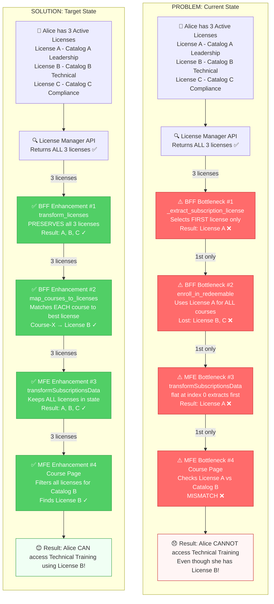
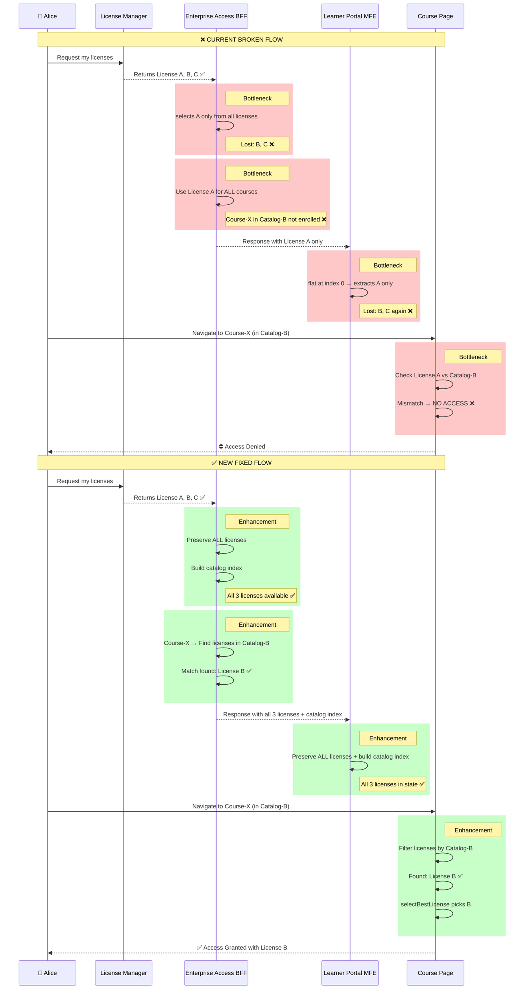
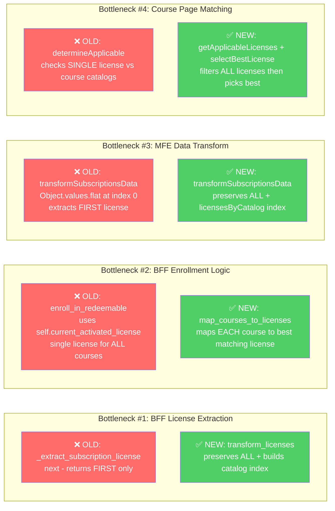
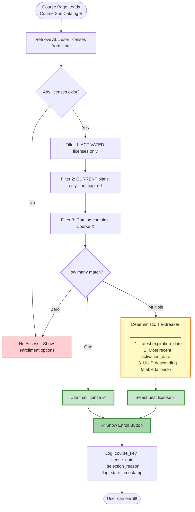
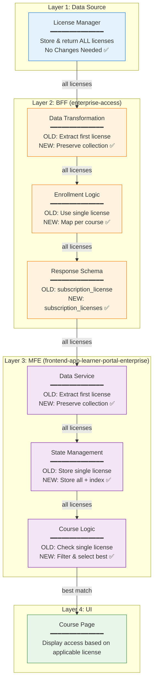

# Multiplex Subscription Licenses - Technical Implementation

**Date:** March 26, 2026
**Version:** 1.0
**Status:** Proposed Architecture
**Scope:** Flowcharts, Component Design, Code Implementation, Tests

---

## Table of Contents

1. [Problem Statement](#problem-statement)
2. [Visual Flowcharts](#visual-flowcharts)
3. [Architectural Principles](#architectural-principles)
4. [Detailed Component Design](#detailed-component-design)
5. [Feature Flags](#feature-flags)
6. [Test Data Builders](#test-data-builders)
7. [Test Implementations](#test-implementations)

---

## Problem Statement

The BFF layer in `enterprise_access/apps/bffs/handlers.py` collapses multiple licenses to a single one at **4 bottlenecks**. The fix is a **collection-first** approach: preserve all licenses until the course-level context can make the correct match.

**Root cause:** Selection happens too early (data layer), losing information needed for downstream decisions.

**Fix:** Defer selection to course context. Pass the full collection through every layer.

---

## Visual Flowcharts

### Complete System Transformation



---

### Detailed Data Flow: Problem vs Solution



---

### The 4 Bottlenecks: Old vs New Code



---

### Deterministic License Selection Algorithm



---

### Architecture Layer Responsibility



---


## Architectural Principles

### 1. Collection-First Design
```python
# ❌ BAD: Early selection loses information
def get_user_license(user_id):
    licenses = fetch_all_licenses(user_id)
    return licenses[0]  # Information loss!

# ✅ GOOD: Preserve collection, defer selection
def get_user_licenses(user_id):
    return fetch_all_licenses(user_id)  # Complete data

def get_applicable_license_for_course(licenses, course_id):
    return find_best_match(licenses, course_id)  # Context-aware selection
```

### 2. Single Responsibility Per Layer
| Layer | Responsibility |
|-------|---------------|
| **License Manager** | Persist and return license records — no business logic |
| **BFF** | Fetch, transform, enrich data for frontend — no selection |
| **MFE** | Display data, handle user interaction — selection at course context |
| **Business Logic** | Determine applicability rules — separate and testable |

### 3. Fail-Safe Defaults
```python
# Feature flag OFF → legacy single-license behavior (safe)
# Feature flag ON  → new multi-license behavior
# Flag read error  → defaults to OFF (safe)
```

### 4. Key Design Decisions

| Decision | Rationale |
|----------|-----------|
| Collection-first contract | Prevents information loss; enables downstream flexibility |
| Deterministic selection algorithm | Predictable, reproducible, debuggable |
| Feature flags at BFF + MFE | Independent rollout; quick rollback |
| Backward-compatible schema | Zero disruption to existing integrations |
| Per-course license matching | Correct entitlements; honors catalog boundaries |
| No License Manager changes | Minimal blast radius; faster delivery |

---

## Detailed Component Design

### Component 1: License Manager (No Changes)

**Status:** ✅ Already works correctly — returns ALL licenses.

**Interface Contract (unchanged):**
```json
{
  "count": 3,
  "results": [
    {
      "uuid": "license-uuid",
      "status": "activated|assigned|revoked",
      "activation_date": "ISO-8601",
      "subscription_plan": {
        "uuid": "plan-uuid",
        "enterprise_catalog_uuid": "catalog-uuid",
        "is_current": true,
        "expiration_date": "YYYY-MM-DD"
      }
    }
  ]
}
```

---

### Component 2: Enterprise Access BFF

**File:** `enterprise_access/apps/bffs/handlers.py`

#### 2.1 Data Transformation Layer

**Current — Bottleneck #1** (line 262):
```python
def _extract_subscription_license(self, subscription_licenses_by_status):
    """Returns FIRST license only ❌"""
    return next((
        license
        for status in [ACTIVATED, ASSIGNED, REVOKED]
        for license in subscription_licenses_by_status.get(status, [])
    ), None)
```

**Proposed — Collection-First:**
```python
class SubscriptionLicenseProcessor:
    """
    Handles subscription license data transformation.
    Preserves collection semantics while maintaining backward compatibility.
    """

    def transform_licenses(self, subscription_licenses_by_status, feature_flag_enabled=False):
        """
        Transform license data with collection-first approach.

        Args:
            subscription_licenses_by_status: Dict[str, List[License]]
            feature_flag_enabled: bool - ENABLE_MULTI_LICENSE_ENTITLEMENTS_BFF

        Returns:
            Dict with both collection and legacy singular fields
        """
        activated_licenses = subscription_licenses_by_status.get(
            LicenseStatuses.ACTIVATED, []
        )

        # Sort: current plans first, then by expiration date
        sorted_activated = sorted(
            activated_licenses,
            key=lambda lic: (
                not lic.get('subscription_plan', {}).get('is_current', False),
                lic.get('subscription_plan', {}).get('expiration_date', '')
            )
        )

        return {
            # ✅ NEW: Collection-first (canonical)
            'subscription_licenses': sorted_activated,
            'subscription_licenses_by_status': subscription_licenses_by_status,

            # ✅ NEW: Pre-computed catalog index for O(1) lookups
            'licenses_by_catalog': self._index_by_catalog(sorted_activated) if feature_flag_enabled else None,

            # ⚠️ DEPRECATED: Backward compatibility (remove in 6 months)
            'subscription_license': sorted_activated[0] if sorted_activated else None,
            'subscription_plan': sorted_activated[0].get('subscription_plan') if sorted_activated else None,

            # ✅ NEW: Schema version for client compatibility
            'license_schema_version': 'v2' if feature_flag_enabled else 'v1',
        }

    def _index_by_catalog(self, licenses):
        """
        Create catalog UUID → licenses mapping for O(1) lookups.

        Returns:
            Dict[str, List[License]]
        """
        catalog_index = {}
        for license in licenses:
            catalog_uuid = license.get('subscription_plan', {}).get('enterprise_catalog_uuid')
            if catalog_uuid:
                catalog_index.setdefault(catalog_uuid, []).append(license)
        return catalog_index
```

---

#### 2.2 Enrollment Intention Handler

**Current — Bottleneck #2** (in `enroll_in_redeemable_default_enterprise_enrollment_intentions`):
```python
# Uses single self.current_activated_license for ALL courses ❌
if not self.current_activated_license:
    return

for enrollment_intention in needs_enrollment_enrollable:
    subscription_catalog = self.current_activated_license.get(
        'subscription_plan', {}
    ).get('enterprise_catalog_uuid')

    if subscription_catalog in applicable_catalogs:
        license_uuids_by_course[course_run_key] = self.current_activated_license['uuid']
```

**Proposed — Per-Course Matching:**
```python
def _map_courses_to_licenses(self, enrollment_intentions):
    """
    ✅ NEW: Map each course to its best-matching license.

    Algorithm:
    1. For each course, find ALL licenses whose catalog contains the course.
    2. If multiple match, apply deterministic tie-breaker:
       a. Latest expiration_date  (maximize access window)
       b. Most recent activation_date  (prefer newer)
       c. UUID lexical order DESC  (deterministic fallback)

    Returns:
        Dict[str, str] - course_run_key → license_uuid
    """
    activated_licenses = self._get_current_activated_licenses()
    if not activated_licenses:
        logger.info("No activated licenses found for multi-license enrollment")
        return {}

    licenses_by_catalog = self._build_catalog_index(activated_licenses)
    license_course_mappings = {}

    for intention in enrollment_intentions:
        course_run_key = intention['course_run_key']
        applicable_catalogs = intention.get('applicable_enterprise_catalog_uuids', [])

        matching_licenses = []
        for catalog_uuid in applicable_catalogs:
            matching_licenses.extend(licenses_by_catalog.get(catalog_uuid, []))

        if not matching_licenses:
            logger.debug("No license for course %s (catalogs: %s)", course_run_key, applicable_catalogs)
            continue

        best_license = self._select_best_license(matching_licenses)
        license_course_mappings[course_run_key] = best_license['uuid']
        logger.info(
            "Mapped course %s to license %s (catalog: %s, expiration: %s)",
            course_run_key,
            best_license['uuid'],
            best_license['subscription_plan']['enterprise_catalog_uuid'],
            best_license['subscription_plan']['expiration_date'],
        )

    return license_course_mappings


def _select_best_license(self, licenses):
    """
    Deterministic tie-breaker for multiple matching licenses.

    Precedence:
    1. Latest expiration_date (longest access window)
    2. Most recent activation_date (prefer newer)
    3. UUID DESC (stable sort)
    """
    if len(licenses) == 1:
        return licenses[0]

    return max(
        licenses,
        key=lambda lic: (
            lic.get('subscription_plan', {}).get('expiration_date', ''),
            lic.get('activation_date', ''),
            lic.get('uuid', ''),
        )
    )


def _build_catalog_index(self, licenses):
    """Build catalog_uuid → licenses mapping for efficient lookup."""
    index = {}
    for license in licenses:
        catalog_uuid = license.get('subscription_plan', {}).get('enterprise_catalog_uuid')
        if catalog_uuid:
            index.setdefault(catalog_uuid, []).append(license)
    return index


def _map_courses_to_single_license(self, enrollment_intentions):
    """⚠️ LEGACY: Backward-compatible single-license mapping."""
    current_license = self.current_activated_license
    if not current_license:
        return {}

    subscription_catalog = current_license.get('subscription_plan', {}).get('enterprise_catalog_uuid')
    mappings = {}
    for intention in enrollment_intentions:
        applicable_catalogs = intention.get('applicable_enterprise_catalog_uuids', [])
        if subscription_catalog in applicable_catalogs:
            mappings[intention['course_run_key']] = current_license['uuid']
    return mappings
```

---

#### 2.3 BFF Response Serializer

**File:** `enterprise_access/apps/bffs/serializers.py`

**Proposed additions to `SubscriptionsSerializer`:**
```python
class SubscriptionsSerializer(BaseBffSerializer):
    """
    Serializer for subscriptions subsidies.
    Extends existing serializer with multi-license fields.
    """

    customer_agreement = CustomerAgreementSerializer(required=False, allow_null=True)

    # ✅ NEW: Collection-first (canonical)
    subscription_licenses = SubscriptionLicenseSerializer(many=True, required=False, default=list)
    subscription_licenses_by_status = SubscriptionLicenseStatusSerializer(required=False)

    # ✅ NEW: Pre-computed catalog index (feature flag ON only)
    licenses_by_catalog = serializers.DictField(
        child=serializers.ListField(child=SubscriptionLicenseSerializer()),
        required=False,
        allow_null=True,
        help_text="Pre-computed catalog_uuid → licenses mapping for O(1) lookups.",
    )

    # ✅ NEW: Schema version indicator
    license_schema_version = serializers.CharField(
        required=False,
        default='v1',
        help_text="'v1' = single-license (legacy), 'v2' = multi-license.",
    )

    # ⚠️ DEPRECATED: Keep for backward compatibility only
    subscription_license = SubscriptionLicenseSerializer(required=False, allow_null=True)
    subscription_plan = SubscriptionPlanSerializer(required=False, allow_null=True)

    show_expiration_notifications = serializers.BooleanField(required=False, default=False)
```

---

### Component 3: Learner Portal MFE

#### 3.1 Data Service Layer

**File:** `src/data/services/userSubsidy.js` (or equivalent)

**Current — Bottleneck #3:**
```javascript
// ❌ Extract first license only
const applicableSubscriptionLicense = Object.values(
  subscriptionLicensesByStatus
).flat()[0];

subscriptionsData.subscriptionLicense = applicableSubscriptionLicense;
```

**Proposed — Collection Preservation:**
```javascript
/**
 * Transform subscription license data with collection-first approach.
 *
 * @param {SubscriptionLicense[]} subscriptionLicenses - All licenses from BFF
 * @param {CustomerAgreement} customerAgreement
 * @param {string} licenseSchemaVersion - 'v1' or 'v2'
 * @returns {Object} Transformed subscription data
 */
export function transformSubscriptionsData({
  subscriptionLicenses,
  customerAgreement,
  licenseSchemaVersion = 'v1',
}) {
  const subscriptionsData = { ...getBaseSubscriptionsData() };

  if (subscriptionLicenses) {
    subscriptionsData.subscriptionLicenses = subscriptionLicenses;
  }
  if (customerAgreement) {
    subscriptionsData.customerAgreement = customerAgreement;
  }

  subscriptionsData.showExpirationNotifications = !(
    customerAgreement?.disableExpirationNotifications
    || customerAgreement?.hasCustomLicenseExpirationMessagingV2
  );

  // Sort: current plans first, then latest expiration
  subscriptionsData.subscriptionLicenses = [...subscriptionLicenses].sort((a, b) => {
    if (a.subscriptionPlan.isCurrent !== b.subscriptionPlan.isCurrent) {
      return a.subscriptionPlan.isCurrent ? -1 : 1;
    }
    return new Date(b.subscriptionPlan.expirationDate) - new Date(a.subscriptionPlan.expirationDate);
  });

  // Group by status
  subscriptionsData.subscriptionLicenses.forEach((license) => {
    if (license.status !== LICENSE_STATUS.UNASSIGNED) {
      subscriptionsData.subscriptionLicensesByStatus = addLicenseToSubscriptionLicensesByStatus({
        subscriptionLicensesByStatus: subscriptionsData.subscriptionLicensesByStatus,
        subscriptionLicense: license,
      });
    }
  });

  // ✅ NEW: Build catalog index for O(1) lookups
  subscriptionsData.licensesByCatalog = buildCatalogIndex(subscriptionsData.subscriptionLicenses);

  // ✅ NEW: Store schema version
  subscriptionsData.licenseSchemaVersion = licenseSchemaVersion;

  // ⚠️ BACKWARD COMPAT: Keep singular field for legacy consumers
  const legacyLicense = Object.values(subscriptionsData.subscriptionLicensesByStatus).flat()[0];
  if (legacyLicense) {
    subscriptionsData.subscriptionLicense = legacyLicense;
    subscriptionsData.subscriptionPlan = legacyLicense.subscriptionPlan;
  }

  return subscriptionsData;
}

/**
 * ✅ NEW: Build catalog UUID → activated licenses index.
 */
function buildCatalogIndex(licenses) {
  const index = {};
  licenses.forEach((license) => {
    if (license.status !== LICENSE_STATUS.ACTIVATED) return;
    if (!license.subscriptionPlan?.isCurrent) return;
    const catalogUuid = license.subscriptionPlan.enterpriseCatalogUuid;
    if (!catalogUuid) return;
    if (!index[catalogUuid]) index[catalogUuid] = [];
    index[catalogUuid].push(license);
  });
  return index;
}
```

---

#### 3.2 License Matching Utilities

**Current — Bottleneck #4:**
```javascript
// ❌ Checks only a single license
export function determineSubscriptionLicenseApplicable(subscriptionLicense, catalogsWithCourse) {
  return (
    subscriptionLicense?.status === LICENSE_STATUS.ACTIVATED
    && subscriptionLicense?.subscriptionPlan.isCurrent
    && catalogsWithCourse.includes(subscriptionLicense?.subscriptionPlan.enterpriseCatalogUuid)
  );
}
```

**Proposed — Multi-License Matching:**
```javascript
/**
 * ✅ NEW: Filter all licenses applicable to a specific course.
 *
 * @param {SubscriptionLicense[]} subscriptionLicenses
 * @param {string[]} catalogsWithCourse - catalog UUIDs containing this course
 * @returns {SubscriptionLicense[]}
 */
export function getApplicableLicensesForCourse(subscriptionLicenses, catalogsWithCourse) {
  if (!subscriptionLicenses?.length || !catalogsWithCourse?.length) return [];

  return subscriptionLicenses.filter(license => (
    license?.status === LICENSE_STATUS.ACTIVATED
    && license?.subscriptionPlan?.isCurrent === true
    && catalogsWithCourse.includes(license?.subscriptionPlan?.enterpriseCatalogUuid)
  ));
}

/**
 * ✅ NEW: Select the best license from multiple applicable licenses.
 *
 * Deterministic precedence:
 * 1. Latest expiration_date
 * 2. Most recent activation_date
 * 3. UUID descending (stable fallback)
 *
 * @param {SubscriptionLicense[]} applicableLicenses
 * @returns {SubscriptionLicense|null}
 */
export function selectBestLicense(applicableLicenses) {
  if (!applicableLicenses?.length) return null;
  if (applicableLicenses.length === 1) return applicableLicenses[0];

  return [...applicableLicenses].sort((a, b) => {
    const expDiff = new Date(b.subscriptionPlan.expirationDate) - new Date(a.subscriptionPlan.expirationDate);
    if (expDiff !== 0) return expDiff;

    const actDiff = new Date(b.activationDate) - new Date(a.activationDate);
    if (actDiff !== 0) return actDiff;

    return b.uuid.localeCompare(a.uuid);
  })[0];
}

/**
 * ⚠️ LEGACY: Kept for backward compatibility when flag is OFF.
 * @deprecated Use getApplicableLicensesForCourse + selectBestLicense instead.
 */
export function determineSubscriptionLicenseApplicable(subscriptionLicense, catalogsWithCourse) {
  return (
    subscriptionLicense?.status === LICENSE_STATUS.ACTIVATED
    && subscriptionLicense?.subscriptionPlan.isCurrent
    && catalogsWithCourse.includes(subscriptionLicense?.subscriptionPlan.enterpriseCatalogUuid)
  );
}
```

---

#### 3.3 Course Subsidy Hook

```javascript
import { features } from '@edx/frontend-platform';

/**
 * Enhanced hook with multi-license support.
 * Feature flag controls which path executes.
 */
const useUserSubsidyApplicableToCourse = () => {
  const { courseKey } = useParams();

  const {
    data: {
      subscriptionLicenses,  // ✅ NEW canonical collection
      subscriptionLicense,   // ⚠️ DEPRECATED singular
      licensesByCatalog,     // ✅ NEW catalog index
    },
  } = useSubscriptions();

  const {
    data: { catalogList: catalogsWithCourse },
  } = useEnterpriseCustomerContainsContentSuspense([courseKey]);

  const multiLicenseEnabled = features.ENABLE_MULTI_LICENSE_ENTITLEMENTS;
  let applicableSubscriptionLicense;

  if (multiLicenseEnabled && subscriptionLicenses) {
    // ✅ NEW: Use catalog index (O(1)) if available, else linear scan
    if (licensesByCatalog && catalogsWithCourse.length > 0) {
      const matchingLicenses = catalogsWithCourse.flatMap(
        catalogUuid => licensesByCatalog[catalogUuid] || []
      );
      applicableSubscriptionLicense = selectBestLicense(matchingLicenses);
    } else {
      applicableSubscriptionLicense = selectBestLicense(
        getApplicableLicensesForCourse(subscriptionLicenses, catalogsWithCourse)
      );
    }

    if (applicableSubscriptionLicense) {
      logInfo('Multi-license selection', {
        courseKey,
        selectedLicenseUuid: applicableSubscriptionLicense.uuid,
        selectedCatalog: applicableSubscriptionLicense.subscriptionPlan.enterpriseCatalogUuid,
        totalLicenses: subscriptionLicenses.length,
        applicableCatalogs: catalogsWithCourse,
      });
    }
  } else {
    // ⚠️ LEGACY path
    const isApplicable = determineSubscriptionLicenseApplicable(subscriptionLicense, catalogsWithCourse);
    applicableSubscriptionLicense = isApplicable ? subscriptionLicense : null;
  }

  const userSubsidyApplicableToCourse = getSubsidyToApplyForCourse({
    applicableSubscriptionLicense,
    // ... other subsidies (coupons, offers, learner credit) ...
  });

  return { userSubsidyApplicableToCourse };
};

export default useUserSubsidyApplicableToCourse;
```

---

## Feature Flags

Two independent flags allow BFF and MFE to be enabled separately.

**Backend — Waffle flag:**
```python
# enterprise-access/enterprise_access/apps/bffs/handlers.py

from django.conf import settings

# Usage in handler:
feature_flag_enabled = waffle.flag_is_active(request, 'ENABLE_MULTI_LICENSE_ENTITLEMENTS_BFF')

if feature_flag_enabled:
    license_course_mappings = self._map_courses_to_licenses(needs_enrollment_enrollable)
else:
    license_course_mappings = self._map_courses_to_single_license(needs_enrollment_enrollable)
```

**Frontend — env config:**
```javascript
// frontend-app-learner-portal-enterprise/env.config.js
module.exports = {
  FEATURE_FLAGS: {
    ENABLE_MULTI_LICENSE_ENTITLEMENTS: false, // set true to enable
  },
};
```

**Flag behavior:**

| BFF Flag | MFE Flag | Behavior |
|----------|----------|----------|
| OFF | OFF | Full legacy single-license behavior |
| ON | OFF | BFF sends multi-license data; MFE still uses first |
| ON | ON | Full multi-license end-to-end |
| OFF | ON | MFE multi-logic runs but falls back to single license |

---

## Test Data Builders

```python
# enterprise-access/tests/builders.py

import uuid
from django.utils import timezone
from enterprise_access.apps.api_client.constants import LicenseStatuses


class LicenseBuilder:
    """Builder pattern for test license construction."""

    def __init__(self):
        self.uuid = uuid.uuid4()
        self.status = LicenseStatuses.ACTIVATED
        self.catalog_uuid = uuid.uuid4()
        self.expiration_date = '2025-12-31'
        self.activation_date = timezone.now()

    def with_status(self, status):
        self.status = status
        return self

    def with_catalog(self, catalog_uuid):
        self.catalog_uuid = catalog_uuid
        return self

    def with_expiration(self, date):
        self.expiration_date = date
        return self

    def build(self):
        return {
            'uuid': str(self.uuid),
            'status': self.status,
            'activation_date': self.activation_date.isoformat(),
            'subscription_plan': {
                'uuid': str(uuid.uuid4()),
                'enterprise_catalog_uuid': str(self.catalog_uuid),
                'is_current': True,
                'expiration_date': self.expiration_date,
            }
        }


class MultiLicenseScenario:
    """Pre-built multi-license test scenarios."""

    @staticmethod
    def knotion_three_pathways():
        """Knotion use case: 3 licenses, 3 separate catalogs."""
        catalog_a = uuid.uuid4()
        catalog_b = uuid.uuid4()
        catalog_c = uuid.uuid4()

        return {
            'licenses': [
                LicenseBuilder().with_catalog(catalog_a).build(),
                LicenseBuilder().with_catalog(catalog_b).build(),
                LicenseBuilder().with_catalog(catalog_c).build(),
            ],
            'catalogs': {
                'catalog_a': catalog_a,
                'catalog_b': catalog_b,
                'catalog_c': catalog_c,
            }
        }

    @staticmethod
    def overlapping_catalogs():
        """2 licenses both covering the same catalog — tests tie-breaker."""
        shared_catalog = uuid.uuid4()
        return {
            'license_early': LicenseBuilder().with_catalog(shared_catalog).with_expiration('2025-12-31').build(),
            'license_late':  LicenseBuilder().with_catalog(shared_catalog).with_expiration('2026-06-30').build(),
            'catalog': shared_catalog,
        }
```

---

## Test Implementations

### Backend Unit Tests

```python
# enterprise-access/tests/test_multi_license.py

from django.test import TestCase
from unittest import mock
from enterprise_access.apps.bffs.handlers import BaseLearnerPortalHandler
from .builders import LicenseBuilder, MultiLicenseScenario


class TestSelectBestLicense(TestCase):
    """Unit tests for _select_best_license."""

    def _handler(self):
        return BaseLearnerPortalHandler.__new__(BaseLearnerPortalHandler)

    def test_single_license_returned_directly(self):
        licenses = [LicenseBuilder().build()]
        result = self._handler()._select_best_license(licenses)
        self.assertEqual(result['uuid'], licenses[0]['uuid'])

    def test_latest_expiration_wins(self):
        licenses = [
            LicenseBuilder().with_expiration('2025-06-30').build(),
            LicenseBuilder().with_expiration('2025-12-31').build(),  # winner
        ]
        result = self._handler()._select_best_license(licenses)
        self.assertEqual(result['subscription_plan']['expiration_date'], '2025-12-31')

    def test_uuid_fallback_is_deterministic(self):
        # Same expiration and activation → UUID descending wins
        catalog = 'cat-x'
        lic_a = LicenseBuilder().with_catalog(catalog).with_expiration('2025-12-31').build()
        lic_b = LicenseBuilder().with_catalog(catalog).with_expiration('2025-12-31').build()
        lic_a['activation_date'] = lic_b['activation_date']  # force same activation date

        handler = self._handler()
        r1 = handler._select_best_license([lic_a, lic_b])
        r2 = handler._select_best_license([lic_b, lic_a])
        self.assertEqual(r1['uuid'], r2['uuid'])  # stable regardless of order


class TestBuildCatalogIndex(TestCase):
    """Unit tests for _build_catalog_index."""

    def test_groups_licenses_by_catalog(self):
        cat_a = 'cat-a-uuid'
        cat_b = 'cat-b-uuid'
        licenses = [
            LicenseBuilder().with_catalog(cat_a).build(),
            LicenseBuilder().with_catalog(cat_a).build(),
            LicenseBuilder().with_catalog(cat_b).build(),
        ]
        handler = BaseLearnerPortalHandler.__new__(BaseLearnerPortalHandler)
        index = handler._build_catalog_index(licenses)

        self.assertEqual(len(index[cat_a]), 2)
        self.assertEqual(len(index[cat_b]), 1)

    def test_license_without_catalog_is_excluded(self):
        license = LicenseBuilder().build()
        license['subscription_plan'].pop('enterprise_catalog_uuid', None)
        handler = BaseLearnerPortalHandler.__new__(BaseLearnerPortalHandler)
        index = handler._build_catalog_index([license])
        self.assertEqual(index, {})


class TestMapCoursesToLicenses(TestCase):
    """Integration-style tests for _map_courses_to_licenses."""

    @mock.patch.object(BaseLearnerPortalHandler, '_get_current_activated_licenses')
    def test_each_course_mapped_to_correct_catalog_license(self, mock_licenses):
        scenario = MultiLicenseScenario.knotion_three_pathways()
        mock_licenses.return_value = scenario['licenses']

        handler = BaseLearnerPortalHandler.__new__(BaseLearnerPortalHandler)
        intentions = [
            {'course_run_key': 'course-A', 'applicable_enterprise_catalog_uuids': [str(scenario['catalogs']['catalog_a'])]},
            {'course_run_key': 'course-B', 'applicable_enterprise_catalog_uuids': [str(scenario['catalogs']['catalog_b'])]},
            {'course_run_key': 'course-C', 'applicable_enterprise_catalog_uuids': [str(scenario['catalogs']['catalog_c'])]},
        ]

        mappings = handler._map_courses_to_licenses(intentions)

        self.assertEqual(len(mappings), 3)
        self.assertEqual(mappings['course-A'], scenario['licenses'][0]['uuid'])
        self.assertEqual(mappings['course-B'], scenario['licenses'][1]['uuid'])
        self.assertEqual(mappings['course-C'], scenario['licenses'][2]['uuid'])

    @mock.patch.object(BaseLearnerPortalHandler, '_get_current_activated_licenses')
    def test_course_with_no_matching_license_omitted(self, mock_licenses):
        scenario = MultiLicenseScenario.knotion_three_pathways()
        mock_licenses.return_value = scenario['licenses']

        handler = BaseLearnerPortalHandler.__new__(BaseLearnerPortalHandler)
        intentions = [
            {'course_run_key': 'course-X', 'applicable_enterprise_catalog_uuids': ['non-existent-catalog']},
        ]

        mappings = handler._map_courses_to_licenses(intentions)
        self.assertEqual(mappings, {})

    @mock.patch.object(BaseLearnerPortalHandler, '_get_current_activated_licenses')
    def test_overlapping_catalogs_picks_latest_expiration(self, mock_licenses):
        scenario = MultiLicenseScenario.overlapping_catalogs()
        mock_licenses.return_value = [scenario['license_early'], scenario['license_late']]

        handler = BaseLearnerPortalHandler.__new__(BaseLearnerPortalHandler)
        intentions = [
            {'course_run_key': 'course-X', 'applicable_enterprise_catalog_uuids': [str(scenario['catalog'])]},
        ]

        mappings = handler._map_courses_to_licenses(intentions)
        self.assertEqual(mappings['course-X'], scenario['license_late']['uuid'])
```

---

### Backend Integration Tests

```python
# enterprise-access/tests/test_bff_multi_license_integration.py

import pytest
from unittest import mock
from rest_framework.test import APIClient


@pytest.mark.integration
class TestBFFMultiLicenseIntegration:
    """Test BFF dashboard endpoint with multi-license data."""

    @mock.patch('enterprise_access.apps.bffs.api.get_and_cache_subscription_licenses_for_learner')
    def test_dashboard_returns_collection_fields_when_flag_on(self, mock_licenses, waffle_flag):
        waffle_flag('ENABLE_MULTI_LICENSE_ENTITLEMENTS_BFF', active=True)

        mock_licenses.return_value = {
            'results': [
                LicenseBuilder().with_catalog('cat-a').build(),
                LicenseBuilder().with_catalog('cat-b').build(),
            ],
            'customer_agreement': None,
        }

        client = APIClient()
        response = client.post('/api/v1/bffs/learner/dashboard/', {
            'enterprise_customer_uuid': str(uuid.uuid4()),
        })

        assert response.status_code == 200
        data = response.json()
        subscriptions = data['enterprise_customer_user_subsidies']['subscriptions']

        assert 'subscription_licenses' in subscriptions
        assert len(subscriptions['subscription_licenses']) == 2
        assert 'licenses_by_catalog' in subscriptions
        assert subscriptions['license_schema_version'] == 'v2'

    @mock.patch('enterprise_access.apps.bffs.api.get_and_cache_subscription_licenses_for_learner')
    def test_legacy_behavior_preserved_when_flag_off(self, mock_licenses, waffle_flag):
        waffle_flag('ENABLE_MULTI_LICENSE_ENTITLEMENTS_BFF', active=False)

        mock_licenses.return_value = {
            'results': [LicenseBuilder().build()],
            'customer_agreement': None,
        }

        client = APIClient()
        response = client.post('/api/v1/bffs/learner/dashboard/', {
            'enterprise_customer_uuid': str(uuid.uuid4()),
        })

        data = response.json()
        subscriptions = data['enterprise_customer_user_subsidies']['subscriptions']

        assert subscriptions['license_schema_version'] == 'v1'
        assert subscriptions['licenses_by_catalog'] is None
```

---

### Frontend Unit Tests (Jest)

```javascript
// src/utils/licenses.test.js

import { getApplicableLicensesForCourse, selectBestLicense } from './licenses';
import { LICENSE_STATUS } from '../constants';

const activated = (catalogUuid, expiration = '2025-12-31', activationDate = '2024-01-01') => ({
  uuid: `lic-${Math.random()}`,
  status: LICENSE_STATUS.ACTIVATED,
  activationDate,
  subscriptionPlan: { isCurrent: true, enterpriseCatalogUuid: catalogUuid, expirationDate: expiration },
});

describe('getApplicableLicensesForCourse', () => {
  it('returns only activated licenses whose catalog matches', () => {
    const licenses = [activated('cat-a'), activated('cat-b'), { ...activated('cat-c'), status: 'assigned' }];
    const result = getApplicableLicensesForCourse(licenses, ['cat-b']);
    expect(result).toHaveLength(1);
    expect(result[0].subscriptionPlan.enterpriseCatalogUuid).toBe('cat-b');
  });

  it('returns empty array when no match', () => {
    const result = getApplicableLicensesForCourse([activated('cat-a')], ['cat-z']);
    expect(result).toEqual([]);
  });

  it('returns empty array for empty inputs', () => {
    expect(getApplicableLicensesForCourse([], ['cat-a'])).toEqual([]);
    expect(getApplicableLicensesForCourse([activated('cat-a')], [])).toEqual([]);
  });
});

describe('selectBestLicense', () => {
  it('returns null for empty input', () => {
    expect(selectBestLicense([])).toBeNull();
  });

  it('returns the only license if one exists', () => {
    const lic = activated('cat-a');
    expect(selectBestLicense([lic])).toBe(lic);
  });

  it('selects license with latest expiration', () => {
    const early = activated('cat-a', '2025-06-30');
    const late  = activated('cat-a', '2025-12-31');
    expect(selectBestLicense([early, late]).subscriptionPlan.expirationDate).toBe('2025-12-31');
  });

  it('falls back to most recent activation when expiration ties', () => {
    const older = activated('cat-a', '2025-12-31', '2023-01-01');
    const newer = activated('cat-a', '2025-12-31', '2024-06-01');
    expect(selectBestLicense([older, newer]).activationDate).toBe('2024-06-01');
  });

  it('is deterministic regardless of input order', () => {
    const a = activated('cat-a', '2025-12-31', '2024-01-01');
    const b = activated('cat-a', '2025-12-31', '2024-01-01');
    const r1 = selectBestLicense([a, b]);
    const r2 = selectBestLicense([b, a]);
    expect(r1.uuid).toBe(r2.uuid);
  });
});
```

---

### Test Scenarios Reference

| Scenario | Licenses | Expected Outcome | Test Type |
|----------|----------|------------------|-----------|
| Single license (baseline) | 1 activated (cat-A) | Access to cat-A courses only | Regression |
| Three pathways (Knotion) | 3 activated (A, B, C) | Access to all 3 catalogs | Primary use case |
| Overlapping catalogs | 2 activated, same cat-A | Latest expiration selected | Edge case |
| Mixed status | 2 activated, 1 assigned | Assigned auto-activation works | Workflow |
| No matching license | 1 activated (cat-A), view cat-B course | No access returned | Negative |
| Expired license excluded | 2 licenses, 1 expired | Only current license applies | Boundary |
| Flag OFF regression | 3 licenses, flag OFF | Legacy single-license behavior | Backward compat |
| Empty licenses | 0 licenses | No access, no crash | Safety |
