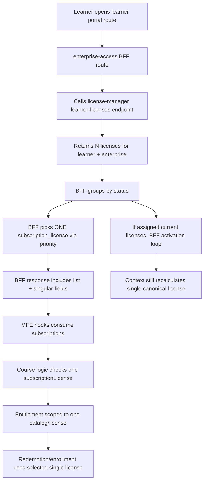
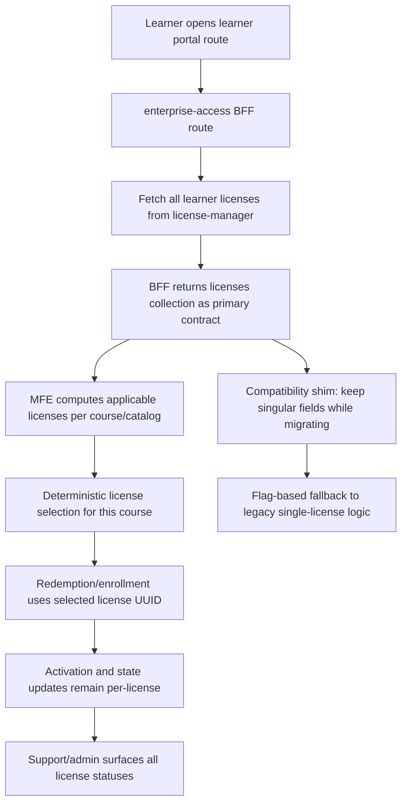

# RFC: Multiplex Subscription Licenses (One Learner, Multiple Active Licenses per Enterprise)

## Document Control
- **Author role:** Architecture / cross-repo design
- **Date:** 2026-03-26
- **Status:** Draft for implementation planning
- **Primary business driver:** Unblock Knotion Learning Pathways by enabling multi-license entitlements within one enterprise

---

## 1) Executive Summary

Today, the platform fetches multiple licenses from backend systems but then collapses them into a **single selected license** for most downstream behavior. That MVP simplification blocks customers who need concurrent, program-specific entitlements (multiple CLOSED catalogs and license pools) for the same learner.

This RFC proposes an implementation-ready approach to:
1. Make license collections the source of truth.
2. Preserve backwards compatibility during rollout.
3. Add deterministic per-course license selection.
4. Keep activation, redemption, support views, and learner UX consistent.
5. Ship safely with feature flags and phased migration.

---

## 2) Scope

### In Scope
- BFF responses and internal model changes so learner subsidy data is collection-first.
- Frontend changes to consume/compute from multiple active licenses.
- Correct activation handling when learner has multiple assigned licenses.
- Support/admin read-path consistency for all assigned/activated/revoked licenses.
- Test-first implementation and phased rollout.

### Out of Scope (for this phase)
- Full learner-credit parity redesign.
- Multi-enterprise identity/entitlement merge.
- Full cross-system redemption rewrite in one release.
- Security/performance architecture overhauls unrelated to this feature.
- Analytics/webhooks/bulk management/time-window enforcement enhancements.

---

## 3) Repositories and Responsibilities

## Core repositories
- **enterprise-access**
  - Learner Portal BFF endpoints and response shaping.
  - License retrieval/activation/auto-apply orchestration.
  - Primary API contract boundary to learner portal MFE.
- **frontend-app-learner-portal-enterprise**
  - Learner subsidy selection logic and course applicability.
  - UI/route behavior depending on one vs many license entitlements.
- **license-manager**
  - Source of license records, statuses, activation, admin lookup.
  - Already supports multiple licenses; ensure behavior parity for multi-license consumer flows.

## Additional touchpoint
- **edx-platform** (enterprise support helpers)
  - Existing helper assumes one active enterprise customer user in some paths.
  - Validate compatibility where support tools or contexts infer “single active” records.

---

## 4) Current Implementation (AS-IS)

## 4.1 Enterprise Access (BFF)
Observed behavior:
- Fetches list of learner licenses from license-manager.
- Groups by status.
- Selects one canonical `subscription_license` using st atus priority.
- Exposes both list and singular fields in response, but singular is heavily used downstream.

Key code paths:
- `enterprise_access/apps/api/v1/views/bffs/learner_portal.py`
- `enterprise_access/apps/bffs/handlers.py`
  - `_extract_subscription_license(...)`
  - `transform_subscriptions_result(...)`
  - `check_and_activate_assigned_license(...)`
  - `enroll_in_redeemable_default_enterprise_enrollment_intentions(...)`
- `enterprise_access/apps/bffs/serializers.py`
  - `SubscriptionsSerializer` includes both:
    - `subscription_licenses` (list)
    - `subscription_license` (single)
    - `subscription_plan` (single)

## 4.2 Learner Portal MFE
Observed behavior:
- `useSubscriptions` returns transformed BFF subsidy data.
- Course applicability and subsidy selection often use a singular `subscriptionLicense`.
- Utility functions assume single license applicability against one catalog in key flows.

Key code paths:
- `src/components/app/data/hooks/useSubscriptions.ts`
- `src/components/app/data/services/subsidies/subscriptions.js`
  - `transformSubscriptionsData(...)` picks first applicable/sorted license
- `src/components/app/data/utils.js`
  - `determineSubscriptionLicenseApplicable(subscriptionLicense, catalogsWithCourse)`
- `src/components/course/data/hooks/useUserSubsidyApplicableToCourse.js`

## 4.3 License Manager
Observed behavior:
- Learner list endpoint returns multiple licenses.
- Activation endpoint operates per activation key.
- Admin lookup endpoint already returns all learner licenses for enterprise/user_email.

Key code paths:
- `license_manager/apps/api/v1/views.py`
  - `LearnerLicensesViewSet`
  - `LicenseActivationView`
  - `AdminLicenseLookupViewSet`
- `enterprise_access/apps/api_client/license_manager_client.py`
  - `get_subscription_licenses_for_learner(...)`
  - `activate_license(...)`
  - `get_learner_subscription_licenses_for_admin(...)`

---

## 5) AS-IS Flowchart

---

## 6) Target Architecture (TO-BE)

### Design principles
1. **Collection-first contract:** `subscription_licenses` is canonical.
2. **Deterministic selection by course:** choose per-course applicable license, not global singleton.
3. **Backward compatibility:** preserve legacy singular fields temporarily.
4. **Non-breaking rollout:** feature flags at BFF + MFE.
5. **Parity and traceability:** activation/support status must match learner-visible state.

### Behavioral target
- A learner may hold multiple active licenses in same enterprise simultaneously.
- For each course page/action, system evaluates all active/current licenses and catalogs.
- If multiple licenses apply, deterministic tie-breaker chooses one.
- Support/admin views show complete license set and statuses.

---

## 7) TO-BE Flowchart

---

## 8) API Schema Delta Plan

## 8.1 BFF response (enterprise-access)
### Current fields
- `subscriptions.subscription_licenses` (list)
- `subscriptions.subscription_licenses_by_status` (grouped list)
- `subscriptions.subscription_license` (single)
- `subscriptions.subscription_plan` (single)

### Proposed contract
1. Keep existing list fields unchanged (canonical source).
2. Introduce optional computed fields for migration clarity:
   - `subscriptions.applicable_subscription_licenses` (list; optional)
   - `subscriptions.selection_policy_version` (string; optional)
3. Keep `subscription_license` and `subscription_plan` as **deprecated compatibility fields**.
4. Add deprecation metadata in API docs/changelog with removal timeline.

### Compatibility strategy
- **Phase 1/2:** populate both new and old fields.
- **Phase 3:** old fields behind fallback flag only.
- **Phase 4:** remove old fields after adoption and telemetry thresholds.

## 8.2 Internal type changes (MFE)
- Update TS types and selectors to model:
  - `subscriptionLicenses: SubscriptionLicense[]`
  - `applicableSubscriptionLicenses?: SubscriptionLicense[]`
- Keep temporary `subscriptionLicense?: SubscriptionLicense | null` for compatibility.

## 8.3 License-manager API
- No mandatory schema changes required for MVP.
- Optional hardening:
  - document ordering guarantees (if any)
  - explicit pagination behavior notes for large license sets

---

## 9) Selection Policy (Deterministic)

## Inputs
- Course catalog membership (`catalogsWithCourse`).
- License attributes: `status`, `subscription_plan.is_current`, `subscription_plan.enterprise_catalog_uuid`, dates.

## Candidate filter
1. `status == activated`
2. `subscription_plan.is_current == true`
3. `subscription_plan.enterprise_catalog_uuid in catalogsWithCourse`

## Tie-breaker (recommended)
Order by:
1. latest `subscription_plan.expiration_date`
2. latest `activation_date`
3. stable UUID lexical fallback

This guarantees deterministic behavior without requiring backend persistence changes.

---

## 10) Migration and Rollout Plan

## Phase 0: Discovery + Test Baseline
- Inventory all single-license assumptions in BFF and MFE.
- Add contract tests proving multi-license payloads are preserved.
- Establish local reproducible fixtures:
  - one learner, one enterprise, multiple active/assigned licenses, different CLOSED catalogs.

## Phase 1: Backend Collection-First Read Path
- Refactor BFF handlers to avoid using a global singular license for new logic.
- Keep existing singular fields populated for compatibility.
- Ensure activation loop handles multiple assigned licenses robustly.

## Phase 2: MFE Dual-Read with Feature Flag
- Add `ENABLE_MULTI_LICENSE_ENTITLEMENTS` flag in MFE.
- Under flag: compute course applicability from license collections.
- Without flag: preserve legacy single-license behavior.

## Phase 3: Support/Admin Consistency Validation
- Validate admin learner profile and support tool output across all assigned licenses.
- Reconcile any mismatch between learner-visible and admin-visible activation status.

## Phase 4: Cutover + Deprecation
- Turn on flags for pilot enterprise(s).
- Observe errors/metrics.
- Expand rollout.
- Remove legacy singular dependency after SLO period and no regressions.

---

## 11) Feature Flags

## Backend
- `ENABLE_MULTI_LICENSE_ENTITLEMENTS_BFF` (bool)
  - Enables new collection-first processing and course-level selection helpers.

## Frontend
- `ENABLE_MULTI_LICENSE_ENTITLEMENTS` (bool)
  - Enables multi-license subsidy applicability logic.

## Flag behavior matrix
- both off: legacy behavior
- backend on + frontend off: safe compatibility mode
- backend off + frontend on: unsupported (prevent via config guard)
- both on: target behavior

---

## 12) Implementation Checklist by Repository

## A) enterprise-access
### API/BFF
- [ ] Refactor `transform_subscriptions_result` to avoid relying on singleton for new code paths.
- [ ] Introduce optional `applicable_subscription_licenses` and `selection_policy_version` in serializer.
- [ ] Keep singular fields for compatibility with clear deprecation comments/docs.

### Activation
- [ ] Confirm activation loop updates grouped data and list data without singleton side-effects.
- [ ] Add idempotence coverage for repeated activation attempts.

### Enrollment intention realization
- [ ] Replace single `current_activated_license` usage with course-level license selection helper.

### Docs
- [ ] Update API docs + changelog with deprecation timeline.

## B) frontend-app-learner-portal-enterprise
### Data model and hooks
- [ ] Extend subscription transformed data model for collection-first usage.
- [ ] Keep temporary compatibility accessor `subscriptionLicense`.

### Course logic
- [ ] Add helper `determineApplicableSubscriptionLicenses(...)` (list result).
- [ ] Update `useUserSubsidyApplicableToCourse` to use per-course selected license from list.
- [ ] Ensure subsidy precedence logic still works (license > coupon/credit/offer as currently intended).

### UI/UX
- [ ] Decide if learner-facing license switcher is required in MVP.
- [ ] If not, use deterministic auto-selection and expose in telemetry.

## C) license-manager
### API behavior validation
- [ ] Confirm learner-licenses and admin-license-view return complete sets with expected filters.
- [ ] Validate activation endpoint behavior with multiple assigned licenses for same user.

### Optional hardening
- [ ] Add integration tests for same-user multi-license activation sequences.

## D) edx-platform (support helper touchpoints)
- [ ] Validate `get_active_enterprise_customer_user` assumptions do not break support views for this project scope.
- [ ] If needed, isolate helper usage from subscription-license-specific support paths.

---

## 13) Test Matrix (Exact, Repo-by-Repo)

## 13.1 enterprise-access test matrix

### Unit tests
1. **BFF transforms**
   - Input: 3 licenses (2 activated current, 1 assigned current, different catalogs)
   - Expect: all licenses preserved, grouped correctly, deprecation fields still populated.
2. **Activation flow**
   - Input: 2 assigned current licenses with valid keys
   - Expect: activation called for each; statuses updated in response model.
3. **Default enrollment realization**
   - Input: course set spanning catalog A and B
   - Expect: each course mapped to applicable activated license UUID.

### API tests
4. `learner/dashboard` response contract under flag on/off.
5. `learner/search` and `learner/academy` contract parity.

### Regression tests
6. Single-license learner still behaves exactly as before.

## 13.2 frontend-app-learner-portal-enterprise test matrix

### Unit tests
1. `transformSubscriptionsData` preserves full list and deterministic sort.
2. New helper returns all applicable licenses for course catalogs.
3. Deterministic tie-breaker chooses expected UUID for equal candidates.

### Hook tests
4. `useUserSubsidyApplicableToCourse`
   - case A: one applicable license
   - case B: multiple applicable licenses
   - case C: none applicable, fallback reasons unchanged.

### Integration tests
5. Course page renders enroll CTA with selected license from list.
6. Existing single-license snapshots remain valid with flag off.

## 13.3 license-manager test matrix

### API tests
1. `learner-licenses` returns all licenses for user/customer with filters:
   - `current_plans_only=true/false`
   - `include_revoked=true/false`
2. `license-activation` with multiple assigned licenses for same user:
   - valid key activates correct license only
   - second activation remains idempotent.
3. `admin-license-view` returns complete paginated set for user_email/customer.

## 13.4 Cross-repo E2E scenarios

1. **Multi-license dual catalog success**
   - Learner has active licenses in catalogs A + B.
   - Course in A uses license A; course in B uses license B.
2. **Mixed status**
   - assigned(A), activated(B), revoked(C).
   - A can activate, B usable immediately, C excluded for redemption.
3. **No disruption single-license**
   - Legacy enterprise with one active license unaffected.
4. **Support consistency**
   - Learner-visible status equals admin profile/status output.

---

## 14) Data and Observability

## Metrics (recommended)
- Count of learners with >1 active current license per enterprise.
- Entitlement selection outcome distribution (selected license UUID hash/bucket).
- Activation attempts/success/failure rates by status and enterprise.
- MFE fallback-to-legacy path usage while flags enabled.

## Logging
- Structured logs with:
  - enterprise UUID
  - learner ID
  - candidate license count
  - selected license UUID
  - reason/tie-break attributes

## Alerts
- Spike in activation errors.
- Increased enrollment failures where candidate license count > 1.

---

## 15) Risks and Mitigations

1. **Risk:** Regressions in subsidy precedence logic.
   - **Mitigation:** Freeze precedence order in tests and codify deterministic selection.
2. **Risk:** Hidden singleton assumptions in less-traveled routes.
   - **Mitigation:** grep/audit + contract tests for all BFF learner routes.
3. **Risk:** Cross-repo rollout mismatch.
   - **Mitigation:** enforce flag compatibility matrix and staged rollout.
4. **Risk:** Support tool inconsistency.
   - **Mitigation:** explicit cross-check scenarios in E2E and signoff checklist.

---

## 16) Open Questions (for discovery signoff)

1. Should UI expose a learner-visible “license source/program” indicator per course redemption?
2. Is deterministic auto-selection sufficient for MVP, or do any customers require manual chooser in phase 1?
3. What deprecation window is acceptable for singular fields (`subscription_license`, `subscription_plan`)?
4. Do any downstream consumers outside learner portal still depend on singleton semantics?

---

## 17) Proposed Delivery Sequence (2-Week Sprints Example)

## Sprint 1
- Finalize selection policy and compatibility schema.
- Implement backend dual-contract and tests.
- Add feature flags and telemetry scaffolding.

## Sprint 2
- Implement MFE collection-first logic under flag.
- Complete cross-repo integration testing.
- Pilot rollout for Knotion enterprise.

## Sprint 3 (optional hardening)
- Expand rollout.
- Remove or lock down legacy singleton reads where safe.
- Finalize deprecation announcement and removal timeline.

---

## 18) Ready-to-Run Engineering Ticket Template

### Ticket Title
Enable collection-first multi-license entitlement selection for learner portal

### Acceptance Criteria
- Learner with multiple active licenses can redeem courses in each corresponding catalog.
- BFF returns unchanged list contracts and new optional migration fields.
- Legacy singleton behavior remains available behind compatibility fallback.
- Unit/integration tests pass per repository matrix.
- No regression for single-license users.

### Definition of Done
- Code + tests merged in required repos.
- Flags documented and configured.
- Pilot validation complete.
- Monitoring dashboards and alerts enabled.

---

## 19) Appendix: Quick File Map

- `enterprise-access/enterprise_access/apps/api/v1/views/bffs/learner_portal.py`
- `enterprise-access/enterprise_access/apps/bffs/handlers.py`
- `enterprise-access/enterprise_access/apps/bffs/serializers.py`
- `enterprise-access/enterprise_access/apps/api_client/license_manager_client.py`
- `frontend-app-learner-portal-enterprise/src/components/app/data/hooks/useSubscriptions.ts`
- `frontend-app-learner-portal-enterprise/src/components/app/data/services/subsidies/subscriptions.js`
- `frontend-app-learner-portal-enterprise/src/components/app/data/utils.js`
- `frontend-app-learner-portal-enterprise/src/components/course/data/hooks/useUserSubsidyApplicableToCourse.js`
- `license-manager/license_manager/apps/api/v1/views.py`
- `edx-platform/openedx/features/enterprise_support/api.py`

---

## 20) Final Recommendation
Proceed with **dual-contract, flag-gated, collection-first** implementation. This delivers Knotion’s requirement with minimal blast radius and clear migration guardrails, while keeping current single-license tenants stable during adoption.
